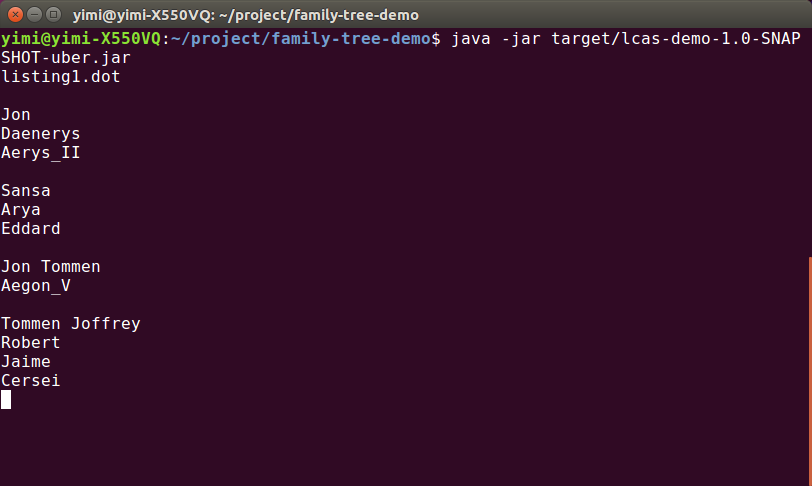

# GSoC 2018 Warmup #

## Compile and run ##

	To run the demo. 
	Firstly download the entire repository.

	Then you can run it directly in the family-tree-demo:
	```
	java -jar target/lcas-demo-1.0-SNAPSHOT-uber.jar
	```

	Or you can compile it before running.
	```
	mvn clean package
	```

## Input format ##

	Every time running it, you need to input .dot file name. Then enter every two names, the program will calculate the closest commom ancestor of two people.

	The next picture shows how it works on my computer.

	

	
